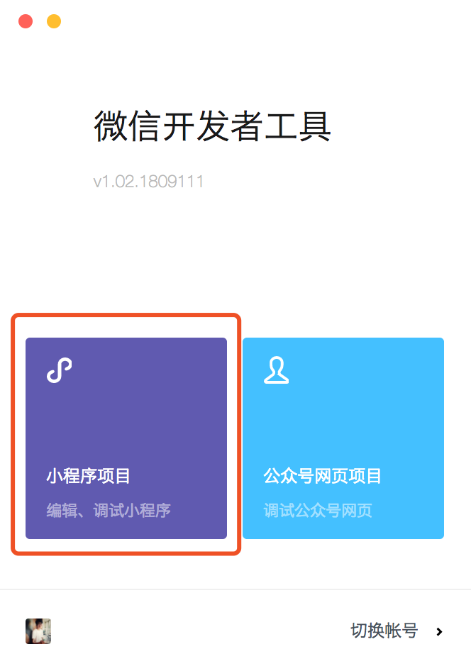
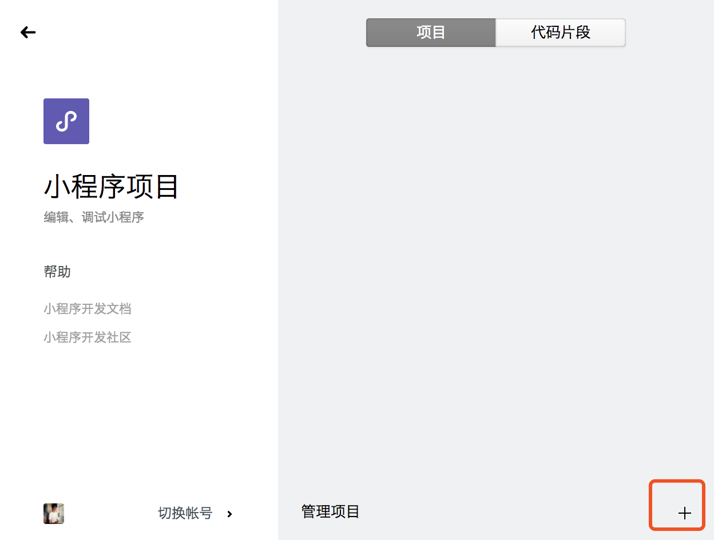
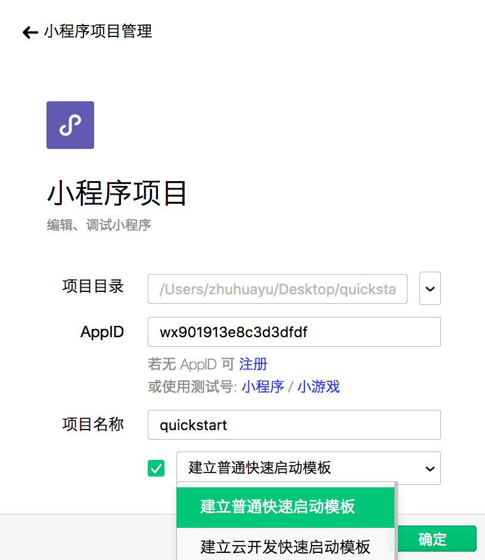
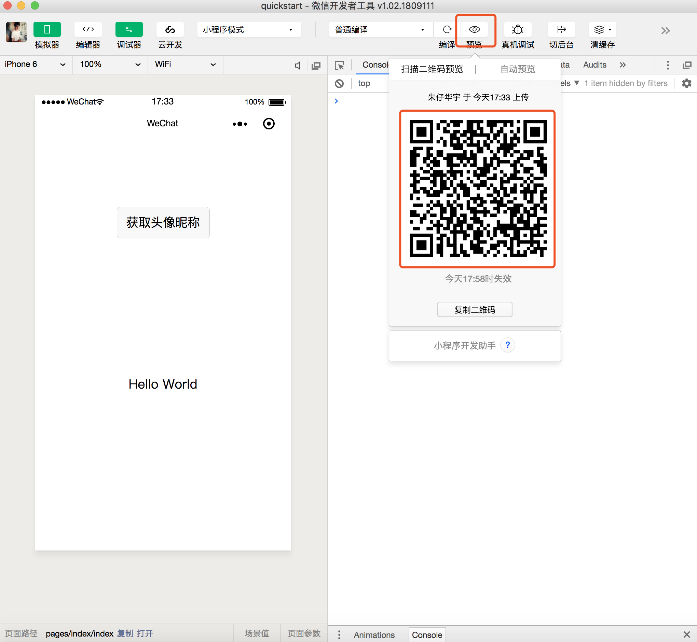

# hackathon_round_1
校园编程马拉松 - 赛事任务 - 1，项目初始化

任务步骤：

1. 在Github仓库中新建一个名为 quickstart 的仓库
2. 在微信公众平台官网首页[mp.weixin.qq.com](https://mp.weixin.qq.com/),参照[小程序接入指南](https://developers.weixin.qq.com/miniprogram/introduction/)，注册微信小程序账号。
3. 在桌面新建 quickstart 文件夹
4. 打开微信开发者工具，选择桌面 quickstart 文件夹，添加微信小程序后台中的 AppID，设置项目名称，选择建立普通快速启动模版
5. 点击工具上的编译按钮，可以在工具的左侧模拟器界面看到这个小程序的表现，也可以点击预览按钮，通过微信的扫一扫在手机上体验你的第一个小程序。
6. 把本地的 quickstart 文件夹，通过 Git 命令同步到 Github 远程 quickstart 仓库，如果有疑问请参考训练一中，Github Pages 的操作。
7. 完成后在 huashangxueyuan/hackathon_round_1 的 issue 中提交即可。

